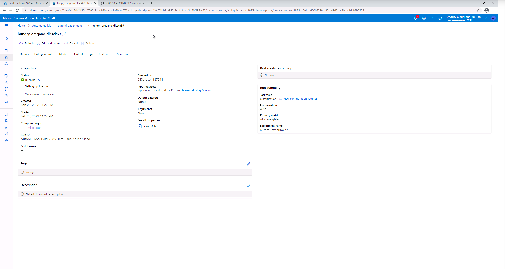

# Operationalizing Machine Learning in Azure ML
### Overview : 
This project is part of the Machine Learning Engineer with Microsoft Azure Udacity Nanodegree. The project involves creation of a cloud-based AutoML model, deployment into an endpoint, consumption of the endpoint for prediction and deploying a pipeline. 

## Architectural Diagram

## Key Steps
The project involves the following key steps:

1. **Authentication** : Installing the Azure Machine Learning Extension, creating a Service Principal and associating it with the workspace. 
2. **Automated ML Experiment** : Uploading the dataset, initialising a compute cluster and running the AutoML experiment to find the best classification model. 
3. **Deploy the best model** : Deploying the best classification model into an endpoint. 
4. **Enable logging** : Enabling logging and application insights to monitor the endpoint. 
5. **Swagger Documentation** : Using swagger documentation with the swagger.json data from the endpoint to browse the endpoint requests and responses.
6. **Consume model endpoints** : Interacting with the model endpoints using test JSON payloads. 
7. **Create and publish a pipeline** : Automation of the workflow and publication of the pipeline with the endpoint. 

## Description of the steps

### 1. Authentication
The provided Udacity workspace was pre-configured, so this step was skipped.

### 2. Automated ML Experiment
First, the [Bank Marketing](https://automlsamplenotebookdata.blob.core.windows.net/automl-sample-notebook-data/bankmarketing_train.csv) dataset was uplaoded to the workspace and **'y'** was selected as the target column for classification.

*Figure 1: Registered Datasets*

*Figure 2: Running AutoML Experiment*

A **Standard_DS12_v2** cluster was created for the Virtual Machine and 1 as the **minimum number of nodes**, **Concurrency** set to 5 and **Exit criterion** changed to 1 hour. 

*Figure 3: Completed AutoML Experiment*

After the AutoML run had completed, the list of models under the **Models** tab was listed by descending AUC weighted value:

*Figure 4: Model list* 

The best model can be accessed by clicking on it to view the information and metrics:

*Figure 5: Best Model Information*

*Figure 6: Best Model Details*

*Figure 7: Best Model Metrics*

### 3. Deploy the best model

The best model can then be deployed into an endpoint using the *Deploy* option. The Model was deployed as a web service, selecting *Azure Container Instance* and enabling authentication. Wait until the endpoint has reached a *Healthy* status. 

*Figure 8: Model Deployment*

*Figure 9: Endpoints List*

### 4. Enable logging

Enabling application insights is useful to monitor the endpoint activity. First the config.json file can be downloaded for the workspace by selecting the workspace ID from the top right in Azure ML studio. The config.json file needs to be placed in the same directory as the logs.py, and then ensure the endpoint status is healthy before running the logs.py script from the terminal:
`python logs.py`

*Figure 10: Enabling logging*

Then check the endpoint, it will refresh and once in a healthy state the application insights enabled should be True

*Figure 11: Insights enabled*

### 5. Swagger Documentation

To consume the best AutoML model using Swagger, download the **swagger.json** file from the endpoint. Save this into the **swagger** directory with **server.py**. Then run the **swagger.sh** and **serve.py** files to explore the documentation for the endpoint.

*Figure 12: Swagger Documentation With Endpoint*

*Figuer 13: Swagger Post request responses*

### 6. Consume model endpoints

To interact with the model using the endpoint, the **scoring_uri** and the **key** must be updated in the **endpoint.py** script prior to running the script in the terminal.

*Figure 14: Consuming the endpoint*

### 7. Create and publish a pipeline

The Jupyter Notebook named **aml-pipelines-with-automated-machine-learning-step** was used to create a **Pipeline** The notebook aids in creating a pipeline for running the AutoML experiment and then deploying the best model into a pipeline endpoint and consuming the endpoint with a pipeline run.

*Figure 15: Notebook Pipeline run Details*

*Figure 16: Pipeline Runs*

*Figure 17: Pipeline Endpoint*

*Figure 18: Published Endpoint*

*Figure 19: Pipeline Run Overview*

*Figure 20: Pipeline Endpoint Runs*

## Screen Recording

- Link to screen recording **submission** - https://www.youtube.com/watch?v=S9j_hDimD_0

## Suggested Improvements
The dataset is highly imbalanced, so addressing the imbalanced classes should yield an improvement over the existing model because with around 90% of the of the records belonging to one class, even a poor model could classify all records as belonging to the same class and achieve a very high accuracy in class prediction. 
